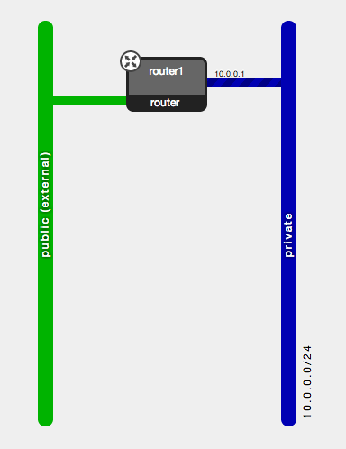

# Neutron-enabled DevStack in a Vagrant VM with Ansible

This repository contains a Vagrantfile and an accompanying Ansible playbook
that sets up a VirtualBox virtual machine that installs [DevStack](http://devstack.org).

Ansible generates a `local.conf` file that defaults to:

 * Use Neutron for networking
 * Install Swift for object storage
 * Install Solum for Application development
 * Install Tempest for functional testing

## Memory usage

By default, the VM uses 8GB of RAM. If you want to change this, edit the
following line in Vagrantfile:

    vb.customize ["modifyvm", :id, "--memory", 8192]

## Prereqs

Install the following applications on your local machine first:

 * [VirtualBox](http://virtualbox.org)
 * [Vagrant](http://vagrantup.com)
 * [Ansible](http://ansibleworks.com)

If you want to try out the OpenStack command-line tools once DevStack is running, install the following Python packages:

  * python-novaclient
  * python-neutronclient

The easiest way to install the Python packages is with pip:

    sudo pip install python-novaclient python-neutronclient

## Boot the virtual machine and install DevStack

    git clone https://github.com/julienvey/devstack-vagrant
    cd devstack-vagrant
    vagrant up

The `vagrant up` command will:

 1. Download an Ubuntu 13.10 (saucy) vagrant box if it hasn't previously been downloaded to your machine.
 2. Boot the virtual machine (VM).
 3. Clone the DevStack git repository inside of the VM.
 4. Run DevStack inside of the VM.
 5. Add eth2 to the br-ex bridge inside of the VM to enable floating IP access from the host machine.

It will take at least ten minutes for this to run, and possibly much longer depending on your internet connection and whether it needs to download the Ubuntu vagrant box.

## Allow VMs to connect to the internet (Linux hosts only)

By default, VMs started by OpenStack will not be able to connect to the
internet. If you want your VMs to connect out, and you are running Linux
as your host operating system, you must configure your host machine to do
network address translation (NAT).

To enable NAT, issue the following commands in your host, as root:

```bash
echo 1 > /proc/sys/net/ipv4/ip_forward
iptables -t nat -A POSTROUTING -o eth0 -j MASQUERADE
```

## Troubleshooting

### Authentication or permission failure

If you see an error like this:

```
devstack | FAILED => Authentication or permission failure. In some cases, you may have been able to authenticate and did not have permissions on the remote directory
```

Then you may have incorrect file permissions in the id_vagrant file. Make sure it is only readable by the owner, by doing:

    chmod 0600 id_vagrant

### Fails to connect

You may ocassionally see the following error message:

```
[default] Waiting for VM to boot. This can take a few minutes.
[default] Failed to connect to VM!
Failed to connect to VM via SSH. Please verify the VM successfully booted
by looking at the VirtualBox GUI.
```

If you see this, retry by doing:

    vagrant destroy --force && vagrant up


## Logging in the virtual machine

The VM is accessible at 192.168.27.100

The easiest way to log in the VM, is to type `vagrant ssh`

You can also use access it using `vagrant` as username and password, or use the provided `id_vagrant` private key to avoid typing a password.

Note that you do not need to be logged in to the VM to run commands against the OpenStack endpoint.

## Loading OpenStack credentials

From your local machine, to run as the demo user:

    source demo.openrc

To run as the admin user:

    source admin.openrc

## Horizon

* URL: http://192.168.27.100
* Username: admin or demo
* Password: password


## Initial networking configuration




DevStack configures an internal network ("private") and an external network ("public"), with a router ("router1") connecting the two together. The router is configured to use its interface on the "public" network as the gateway.


    neutron net-list

    +--------------------------------------+---------+------------------------------------------------------+
    | id                                   | name    | subnets                                              |
    +--------------------------------------+---------+------------------------------------------------------+
    | 07048c67-a7fe-40cb-a059-dcc554a6212f | private | b7733765-e316-4173-9060-e3d16897ec53 10.0.0.0/24     |
    | 5770a693-cfc7-431d-ae29-76f36a2e63c0 | public  | fcc4c031-27a2-46f5-a238-38ddb7160c7e 192.168.50.0/24 |
    +--------------------------------------+---------+------------------------------------------------------+

    $ neutron router-list
    +--------------------------------------+---------+-----------------------------------------------------------------------------+
    | id                                   | name    | external_gateway_info                                                       |
    +--------------------------------------+---------+-----------------------------------------------------------------------------+
    | a6628dda-1db1-49f7-9ae8-aedaee381596 | router1 | {"network_id": "07048c67-a7fe-40cb-a059-dcc554a6212f", "enable_snat": true} |
    +--------------------------------------+---------+-----------------------------------------------------------------------------+


## Launch a cirros instance and attach a floating IP.

Source the credentials of the "demo" user and boot an instance.

    source demo.openrc
    nova keypair-add --pub-key ~/.ssh/id_rsa.pub mykey
    nova boot --flavor m1.nano --image cirros-0.3.1-x86_64-uec --key-name mykey cirros

Once the instance has booted, get its ID.

    nova list

    +--------------------------------------+--------+--------+---------------------------------+
    | ID                                   | Name   | Status | Networks                        |
    +--------------------------------------+--------+--------+---------------------------------+
    | b24fc4ad-2d66-4f28-928b-f1cf78075d33 | cirros | ACTIVE | private=10.0.0.3                |
    +--------------------------------------+--------+--------+---------------------------------+

Use the instance ID to get its neutron port :

    neutron port-list -c id -- --device_id b24fc4ad-2d66-4f28-928b-f1cf78075d33

    +--------------------------------------+
    | id                                   |
    +--------------------------------------+
    | 02491b08-919e-4582-9eb7-f8119c03b8f9 |
    +--------------------------------------+


Use the neutron port ID to create an attach a floating IP to the "public"" network:

    neutron floatingip-create public --port-id 02491b08-919e-4582-9eb7-f8119c03b8f9

    Created a new floatingip:
    +---------------------+--------------------------------------+
    | Field               | Value                                |
    +---------------------+--------------------------------------+
    | fixed_ip_address    | 10.0.0.3                             |
    | floating_ip_address | 172.24.4.227                         |
    | floating_network_id | 5770a693-cfc7-431d-ae29-76f36a2e63c0 |
    | id                  | 480524e1-a5b3-491f-a6ee-9356fc52f81d |
    | port_id             | 02491b08-919e-4582-9eb7-f8119c03b8f9 |
    | router_id           | 0deb0811-78b0-415c-9464-f05d278e9e3d |
    | tenant_id           | 512e45b937a149d283718ffcfc36b8c7     |
    +---------------------+--------------------------------------+

Finally, access your instance:

    ssh cirros@172.24.4.227


## Python bindings example

The included `boot-cirros.py` file illustrates how to executes all of the
above commands using the Python bindings.
